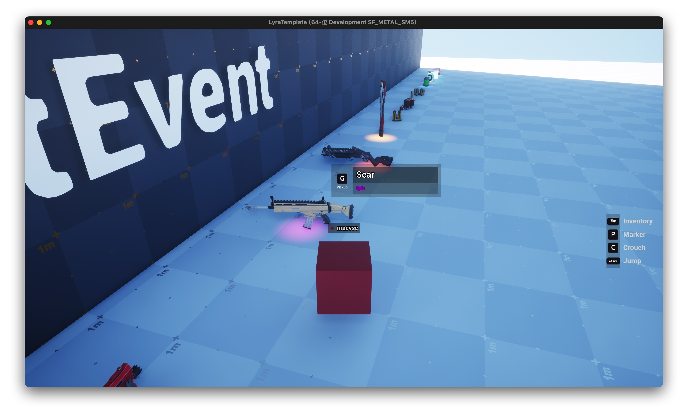
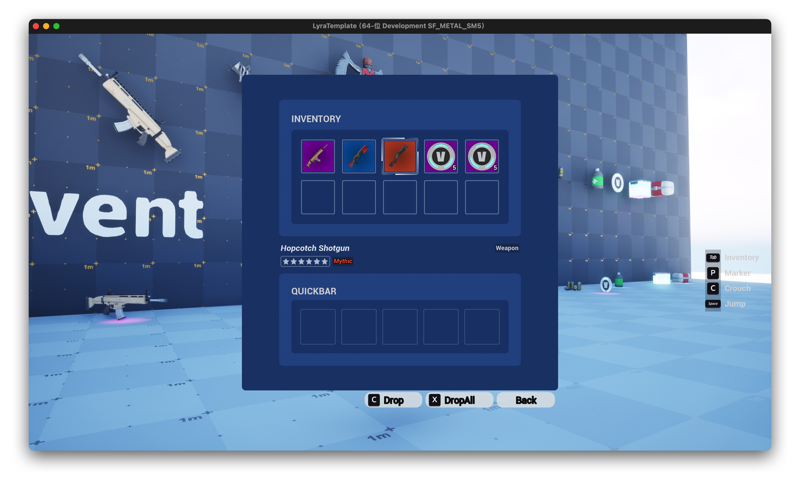
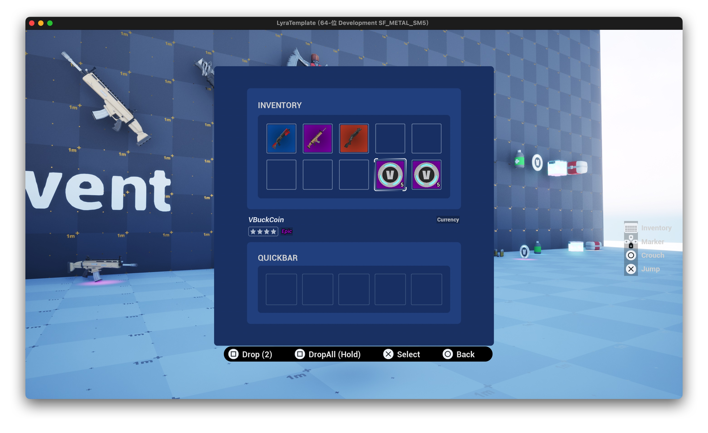
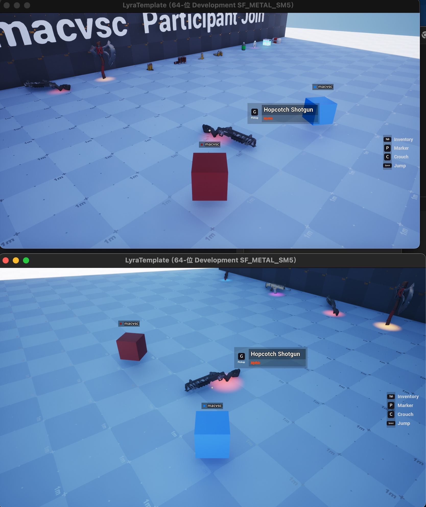

# Lyra Template for Unreal Engine 5

Unreal Engine Version: 5.7.0 (Source Build)

Lyra Version: Compatible with UE 5.7

Macos 15.7.1 / Rider 2025.3

⸻⸻⸻⸻⸻⸻⸻⸻⸻⸻

This branch includes partial modifications to the Lyra source code.  
For detailed information, please refer to the commit history.

⸻⸻⸻⸻⸻⸻⸻⸻⸻⸻

This project extends the Lyra source code and implements a basic inventory system.
It includes item pickup, item dropping, slot swapping, and stack merging.

The system supports both Standalone mode and Dedicated Server multiplayer.
However, Listen Server is not tested or officially supported.

It also provides full gamepad support, including seamless real-time switching between gamepad and mouse input.

If you plan to use this system in multiplayer, please ensure that you configure EOS according to the instructions provided here:

[LyraEos](https://dev.epicgames.com/documentation/en-us/unreal-engine/using-lyra-with-epic-online-services-in-unreal-engine)

