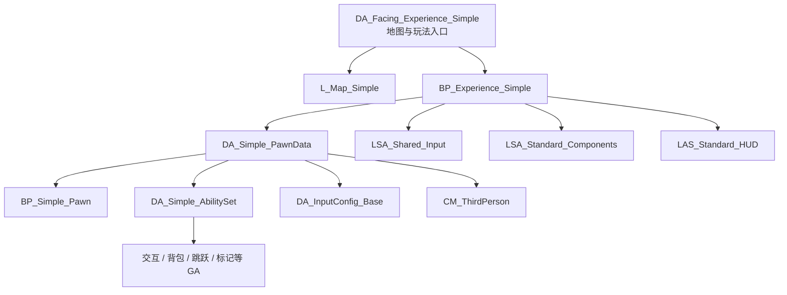
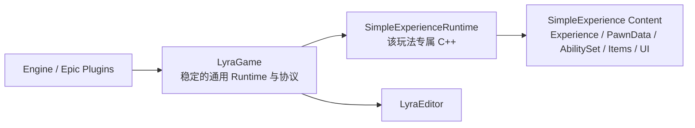

# Lyra 轻量化使用指南（结合 LyraTemplate）

> 适用工程：`LyraTemplate`，Unreal Engine 5.7。本文基于当前仓库的 C++、配置与资产引用关系整理，目标不是复刻完整 Lyra，而是保留它最有价值的组织方式，用尽可能小的心智与运行成本持续开发。

## 1. 先给结论

轻量化使用 Lyra，不等于把 Lyra 的类逐个删除，而是把它当成一套“玩法装配协议”：

- 用 **Experience** 表达“当前运行哪种游戏”。
- 用 **PawnData** 表达“这个玩家角色由什么组成”。
- 用 **AbilitySet** 表达“角色当前拥有哪些能力、效果与属性”。
- 用 **GameplayTag** 连接输入、能力、状态、UI 和消息，减少硬引用。
- 用 **InitState** 解决多人环境中 Pawn、PlayerState、ASC、输入等对象到达顺序不稳定的问题。
- 用 **GameFeature + ActionSet** 注入一个玩法切片需要的组件、输入和 UI。
- 用 **Definition / Instance / Manager**、FastArray 和服务器权威实现可配置、可复制的背包与装备。

对本项目最合适的策略是：

1. 保留 `LyraGame` 作为稳定的通用运行时底座。
2. 把 `SimpleExperience` 当作产品玩法切片，而不是示例资源目录。
3. 新玩法优先通过 Experience、ActionSet、PawnData 和 AbilitySet 装配，不继续向 GameMode、Character 和 PlayerController 堆分支。
4. 先做“资产加载轻量化”，再做“模块编译轻量化”；不要一开始就跨模块搬迁已有反射类。
5. 当前项目特有的背包代码已经大量使用 `/Script/LyraGame` 类路径，短期应保持位置稳定；新代码先遵守边界，待依赖图稳定后再迁移旧代码。

## 2. 本项目现在是怎样装配起来的

### 2.1 工程现状

| 层次 | 当前实现 | 含义 |
|---|---|---|
| 引擎版本 | UE 5.7 | 根目录 `README.md` 已声明 |
| Runtime 模块 | `LyraGame` | Lyra 核心与本项目背包、交互、标记、UI 等扩展目前都在这里 |
| Editor 模块 | `LyraEditor` | 内容验证、资源工厂、编辑器工具，不应进入运行时依赖 |
| 玩法插件 | `Plugins/GameFeatures/SimpleExperience` | 当前唯一的 GameFeature 玩法切片 |
| 默认入口 | `/Game/Map/L_Map_Default` + `BP_Default_GameMode` | 默认先进入前端 Experience，而不是直接进入 Simple 地图 |
| 默认 Experience | `LyraExperienceDefinition:BP_Experience_Default` | 由 `Config/DefaultGame.ini` 配置 |
| 项目示例玩法 | `BP_Experience_Simple` + `L_Map_Simple` | 由 `DA_Facing_Experience_Simple` 关联到前端入口 |
| 联机现状 | Standalone、Dedicated Server | 根目录说明明确；Listen Server 尚未正式验证 |

`SimpleExperience.uplugin` 的关键设置是：

- `EnabledByDefault: true`
- `ExplicitlyLoaded: true`
- `BuiltInInitialFeatureState: Registered`

它表达的不是“启动时无条件运行全部玩法”，而是“插件先注册，何时进入具体玩法由 Experience/前端流程决定”。

### 2.2 SimpleExperience 的真实装配链



当前资产已经很好地演示了轻量 Lyra 的组合方式：

- `BP_Experience_Simple` 只负责选择 PawnData、共享输入、标准组件和 HUD，不承载具体玩法代码。
- `DA_Simple_PawnData` 选择 `BP_Simple_Pawn`、`DA_Simple_AbilitySet`、`DA_InputConfig_Base` 和 `CM_ThirdPerson`。
- `DA_Simple_AbilitySet` 授予交互、丢弃、堆叠、换位、跳跃、标记开关和背包开关等能力。
- `LSA_Shared_Input` 注入 `IMC_Base`。
- `LSA_Standard_Components` 注入背包、快捷栏、武器状态、装备、标记、姓名牌和指示器等组件。
- `LAS_Standard_HUD` 注入 HUD 根布局、准星、快捷栏和 Callout UI。

这里最重要的思想是：**地图只提供世界，Experience 选择规则，PawnData 组装角色，AbilitySet 组装能力，ActionSet 组装外围设施。**

### 2.3 启动时的关键链路

```text
Default Map / 前端选择 / URL 或命令行覆盖
    -> ALyraGameMode 选择 FPrimaryAssetId
    -> ULyraExperienceManagerComponent 加载 Experience
    -> 激活所需 GameFeature，并执行 Actions / ActionSets
    -> GameMode 从 Experience 取得 DefaultPawnData
    -> PlayerState 设置 PawnData，并在服务器授予 AbilitySet
    -> PawnExtension / HeroComponent 推进 InitState
    -> DataInitialized 后绑定输入、相机和 ASC
    -> GameplayReady 后正式进入玩法
```

`ALyraGameMode` 支持从 URL、PIE Developer Settings、命令行、World Settings 和默认配置等位置选择 Experience。开发阶段可以利用 PIE 的 Experience Override 快速直达 `BP_Experience_Simple`，不必为调试反复修改默认地图或 GameMode。

## 3. “轻量化”应分成三个维度

### 3.1 心智轻量化

团队只需要理解一条主干：

```text
Experience -> PawnData -> AbilitySet / InputConfig / CameraMode
           -> ActionSet（组件、输入、UI）
```

新需求先判断它属于哪一个装配点，而不是先寻找一个巨大的基类去继承。

### 3.2 运行与内容轻量化

通过 GameFeature、Primary Asset、软引用、Asset Bundle 和 ActionSet，让未进入的玩法不主动加载。一个 Experience 只引用本玩法所需的 PawnData、组件、UI 和资源。

当前 `LSA_Standard_Components` 同时加入背包、武器、标记、姓名牌等组件，适合作为功能齐全的标准组合，但还不是最小组合。若某模式不需要全部系统，应拆成更细的 ActionSet，例如：

- `LSA_Core_PlayerComponents`
- `LSA_Inventory_Components`
- `LSA_Weapon_Components`
- `LSA_Indicator_Components`
- `LAS_Inventory_HUD`

这样每个 Experience 只支付实际使用的组件和 UI 成本。

### 3.3 编译与依赖轻量化

当前 `LyraGame.Build.cs` 仍公开依赖 GameplayAbilities、AI、GameFeatures、ReplicationGraph、Niagara、Hotfix、CommonLoadingScreen 等许多模块，并私有依赖 CommonUI、GameSettings、GameplayMessageRuntime、Audio、Replay 等模块。

因此：

- 减少 Experience 引用，只会优先改善加载、Cook 和玩法复杂度。
- 删除不用的资产，不会自动缩短 `LyraGame` 的编译依赖。
- 真正减少编译耦合，需要拆分 C++ 模块或精简 `Build.cs`，这是后续阶段，不应与第一轮玩法裁剪混在一起。

## 4. 最值得保留的 Lyra 思想

### 4.1 Experience 是 Composition Root，不是另一个 GameMode

传统项目容易为每种模式派生 GameMode，然后在 GameMode 中继续判断地图、队伍、Pawn、输入和 UI。Lyra 把这些差异变成数据资产与加载动作。

轻量用法：即使项目只有一种主要玩法，也保留一个 Experience。它提供统一的启动边界、加载完成信号和未来扩展点，但不要求你立刻做多个可热卸载模式。

判断准则：

- “这一局加载哪些功能”放在 Experience。
- “这些功能如何实现”放在 Runtime 类或玩法插件。
- “这张地图摆了什么”留在 Map。
- 不在 GameMode 中写针对某张地图或某个玩法的硬编码分支。

### 4.2 PawnData 是角色装配清单

`ULyraPawnData` 集中定义：

- PawnClass
- AbilitySets
- TagRelationshipMapping
- InputConfig
- DefaultCameraMode

因此同一套 GameMode 可以换角色，同一个 Pawn 类也可以通过不同 PawnData 获得不同能力和输入。轻量项目不要为每个角色类型都复制 Character C++ 类；优先判断差异能否放进 PawnData、AbilitySet 或组件。

### 4.3 AbilitySet 是能力包，不是技能目录

`ULyraAbilitySet` 把 GameplayAbility、GameplayEffect、AttributeSet 一次性授予 ASC，并可记录句柄以便撤销。输入标签会进入 AbilitySpec 的动态源标签，输入系统不需要认识具体 GA 类。

轻量用法：

- 角色常驻能力放在 PawnData 的 AbilitySet。
- 装备能力放在 EquipmentDefinition 的 AbilitySet。
- 临时模式能力通过 GameFeature Action 或阶段性 AbilitySet 授予。
- 不在 Character 构造函数中硬编码 `GiveAbility`。

### 4.4 GameplayTag 是稳定协议

本项目已经使用 Tag 串联：

- `InputTag.*`：InputAction 到 GA。
- `InitState.*`：组件初始化阶段。
- `Gameplay.Message.Inventory.StackChanged`：背包变化到 UI。
- HUD Slot Tag：Widget 注入位置。

Tag 的价值不只是“可读枚举”，而是让系统依赖协议而非具体类型。命名时应体现层次，避免到处新增含义相近的平铺标签。

### 4.5 InitState 用来吸收网络时序，不是增加仪式感

Lyra 的四态链路为：

```text
Spawned -> DataAvailable -> DataInitialized -> GameplayReady
```

PlayerState、PawnData、Controller、InputComponent 和 ASC 在客户端到达时间不同。`ULyraPawnExtensionComponent` 与 `ULyraHeroComponent` 通过 InitState 等待前置条件，避免在 `BeginPlay` 中碰运气。

轻量项目可以减少参与者，但不要绕开状态链：

- 只让真正依赖异步/复制数据的组件实现 InitState。
- 普通无依赖组件继续使用正常生命周期。
- 输入、ASC、相机这类跨对象初始化仍等待 `DataInitialized`。

### 4.6 Definition / Instance / Manager 分离静态配置与运行状态

本项目背包与装备体现了这套模式：

| 层 | 职责 | 例子 |
|---|---|---|
| Definition | 设计时只读配置 | `ULyraInventoryItemDefinition`、`ULyraEquipmentDefinition` |
| Fragment | 可组合的静态能力片段 | 图标、稀有度、拾取信息、可装备信息、初始 Stat |
| Instance | 单个物品的运行时状态 | `ULyraInventoryItemInstance`、`ULyraEquipmentInstance` |
| Manager/List | 权威操作、生命周期、复制 | `ULyraInventoryManagerComponent`、`ULyraEquipmentManagerComponent` |

这比“一个大 Item 子类包含所有字段”更适合数据驱动，也让消耗品、武器、弹药等类别按需组合。

### 4.7 跨系统事件优先走消息，不让 UI 反向控制业务

背包列表通过 FastArray 回调识别 Add、Remove、Update、Swap，再广播 `FOnInventoryStackChangeParameters`；背包界面监听 Gameplay Message 更新 UI。

这是值得保留的方向：

```text
服务器修改背包
    -> FastArray 增量复制
    -> 客户端 PostReplicatedChange
    -> GameplayMessageSubsystem 广播
    -> UI 刷新对应槽位
```

UI 可以发起“意图”，但最终状态来自服务器复制；UI 不应成为背包数据的真实来源。

## 5. 本项目的最小保留矩阵

### 5.1 建议始终保留

| 系统 | 原因 |
|---|---|
| AssetManager / Primary Asset | Experience 与 GameFeature 资产发现的基础 |
| Experience Manager | 统一玩法选择、加载状态和完成回调 |
| GameFeatures + ModularGameplay | 通过 ActionSet 注入组件、输入和 UI |
| PawnData + PawnExtension + InitState | 角色装配与网络初始化秩序 |
| Enhanced Input + InputConfig | Tag 驱动输入，兼容键鼠/手柄切换 |
| GAS + AbilitySet | 本项目交互、背包命令、跳跃等已依赖 |
| GameplayMessageRouter | 背包/UI 等跨系统解耦 |
| CommonUI / CommonGame | 当前 HUD、背包与完整手柄导航依赖 |

### 5.2 按玩法选择

| 系统 | 何时保留 |
|---|---|
| Inventory | 有拾取、物品、消耗与背包界面时 |
| Equipment / QuickBar / Weapons | 有装备、武器或快捷栏时 |
| CameraMode Stack | 需要第三人称、瞄准、状态相机混合时 |
| Indicator / Marker / Nameplate | 需要世界标记、物品提示、姓名牌时 |
| UI Layer Stack | 存在 HUD、菜单、模态框和输入焦点切换时 |
| GamePhase | 一局有明确阶段且阶段会授予/阻止能力时 |
| Teams | 规则真正依赖阵营与队伍显示时 |

### 5.3 可以暂缓或关闭候选

以下不是“可以立刻删除”，而是当项目目标明确不需要时，经过引用扫描、Cook 与打包验证后再关闭：

- Bots、AI、SmartObjects、StateTree。
- Teams、Cosmetics、复杂呼叫标记。
- Replay、Hotfix、外部 RPC、性能统计 UI。
- ReplicationGraph：本项目配置中目前 `bDisableReplicationGraph=True`。
- EOS、Steam、PlayFab 等在线栈：只有在目标平台与联机方案确定后再保留对应实现。
- Niagara、Water、Geometry Scripting、Movie Render Pipeline 等非玩法必需插件。

当前 `.uproject` 启用了较多引擎插件。关闭插件前必须同时检查 C++ Build.cs、Config、蓝图父类、资产软引用和打包结果，不能只看编辑器里“似乎没用”。

## 6. 模块边界：当前结构与推荐方向

### 6.1 当前职责

| 模块/目录 | 当前职责 | 风险 |
|---|---|---|
| `LyraGame` | 通用框架、GAS、角色、输入、相机、UI、背包、装备、交互、在线与性能等 | 单体较大；新功能继续加入会扩大编译和耦合成本 |
| `LyraEditor` | 内容验证、编辑器工厂和工具 | 边界清晰，应保持只依赖 Runtime，不被 Runtime 反向依赖 |
| `SimpleExperienceRuntime` | 当前只有模块壳 | 玩法 C++ 尚未真正归属到玩法插件 |
| `SimpleExperience/Content` | 地图、角色装配、Experience、物品与 UI 内容 | 已形成较好的垂直玩法切片 |
| `/Game/ActionSet` | 多个 Experience 共享的输入、组件和 HUD 组合 | “Standard” 组合偏大，模式间容易被迫一起加载 |

### 6.2 推荐目标依赖图



箭头从基础层指向使用它的上层（右侧依赖左侧）。核心规则是：

- `LyraGame` 不引用 `SimpleExperienceRuntime` 或 `/SimpleExperience` 的具体类型。
- `SimpleExperienceRuntime` 可以私有依赖 `LyraGame`。
- 玩法插件的公共头文件只暴露真正需要跨模块使用的契约。
- 具体实现头文件放 `Private`；头文件尽量前置声明，完整 include 放到 `.cpp`。
- 不为了蓝图方便把所有依赖都放进 `PublicDependencyModuleNames`。

`SimpleExperienceRuntime.Build.cs` 目前只有模块壳，甚至还保留 Slate/SlateCore 私有依赖。后续若加入玩法 C++，应按实际 include 增加最小依赖；若仍为空，可以移除没有使用的 Slate 依赖。不要复制 `LyraGame.Build.cs` 的整套依赖。

### 6.3 为什么现在不建议直接搬走背包代码

背包、TargetData、UI 和资产已经引用 `/Script/LyraGame` 下的反射类型。把 `UCLASS/USTRUCT/UENUM` 移到新模块会改变脚本类路径，可能影响：

- 蓝图父类与变量类型。
- DataAsset 中的类引用。
- GameplayAbility 蓝图。
- 序列化与网络数据。
- Cook 资产与重定向。

因此推荐顺序是：先停止新增错误依赖，再记录引用图；确认迁移收益后，配合 Core Redirect、资产重保存与完整回归测试单独执行模块迁移。

## 7. 面向本项目的渐进式落地方案

### 阶段 0：建立基线

- 保证 `BP_Experience_Default` 前端入口可用。
- 保证 `DA_Facing_Experience_Simple` 可以进入 `L_Map_Simple` 与 `BP_Experience_Simple`。
- 分别记录 Standalone 与 Dedicated Server 的启动、登录、拾取、丢弃、堆叠、换位、装备和 UI 手柄操作结果。
- Listen Server 标记为未支持，不要把未验证状态当作已通过。

### 阶段 1：先把 Experience 变小

保留 `BP_Experience_Simple`，把 `LSA_Standard_Components` 和 `LAS_Standard_HUD` 拆成按功能组合的 ActionSet。每移除一组组件，都验证：

- Experience 是否能完成加载。
- Pawn 是否推进到 `GameplayReady`。
- 输入是否绑定。
- ASC 是否得到预期 AbilitySet。
- HUD 与消息监听是否正常注册和清理。

这是收益最高、风险最低的一步。

### 阶段 2：新玩法代码归属到 GameFeature

新需求若只服务于 SimpleExperience，应放到 `SimpleExperienceRuntime`，例如某种特有交互、规则 Actor 或模式组件。只有满足以下条件的代码才进入 `LyraGame`：

- 至少被两个独立玩法复用；或
- 它是所有玩法都依赖的稳定协议/基础类；或
- 它负责全局生命周期而非具体玩法规则。

### 阶段 3：精简插件与 Build.cs

- 先用资产审计和 C++ include 搜索建立依赖清单。
- 一次只关闭一个插件或移除一组模块依赖。
- 每次都编译 Editor、Game、Client、Server 目标，并做 Cook/Package 验证。
- 优先从明确未使用的编辑器/渲染/在线实现开始，不先碰 GAS、GameFeatures、CommonUI、EnhancedInput 和 GameplayMessageRouter 主干。

### 阶段 4：必要时再拆 Runtime 模块

只有当编译时间、多人协作或复用边界产生真实痛点时，再考虑把 Inventory、Interaction、UI 等从 `LyraGame` 拆出。拆分前先确定所有权和单向依赖，不以“目录看起来很多”为理由拆模块。

## 8. 背包系统是怎样体现轻量 Lyra 思想的

本项目对 Lyra 的有效扩展，不只是“增加了一个背包”，而是沿用了 Lyra 的数据、能力与复制管线：

```text
Item Definition + Fragments
    -> World Collectable / Item Spawner
    -> Collect GA（本地预测，服务器权威写入）
    -> Inventory Manager + FastArray
    -> Item Instance 子对象复制
    -> Inventory Changed Gameplay Message
    -> Inventory Screen 局部刷新
```

丢弃、换位、堆叠的路径则是：

```text
UI 生成操作意图
    -> Inventory GA
    -> 自定义 TargetData
    -> ASC 将 TargetData 发送到服务器
    -> 服务器验证并修改 InventoryManager
    -> FastArray 复制最终状态
    -> UI 接收消息更新
```

这里有四个值得继续坚持的原则：

1. **客户端提交意图，服务器提交状态。**
2. **背包组件拥有业务数据，UI 不拥有。**
3. **Definition 保存静态配置，Instance 保存运行状态。**
4. **复制回调转成消息，表现层不直接侵入网络层。**

需要特别注意：客户端上传的 ItemInstance、SlotIndex、数量和位置都属于不可信输入。即使本地已经预检查，服务器仍应验证实例确实属于该玩家、索引对应、数量合法、距离合理，并确保失败路径可以回滚或保持数据不变。

## 9. 新建一个“最小玩法模式”的操作模板

可以复制 SimpleExperience 的装配思路，但不要复制全部内容：

1. 创建新的 GameFeature 插件，并保持 `ExplicitlyLoaded`。
2. 创建 GameFeatureData。
3. 创建一张最小地图和一个 UserFacingExperienceDefinition。
4. 创建 ExperienceDefinition，只设置必要 PawnData 与 ActionSet。
5. 创建 PawnData，至少指定 PawnClass、InputConfig、DefaultCameraMode。
6. 创建最小 AbilitySet，只放 Jump、Interact 等真实需要的 GA。
7. 创建最小共享输入 ActionSet。
8. 只注入需要的 PlayerController/Pawn 组件。
9. 只注入需要的 HUD Widget 与 Layer Slot。
10. 通过 PIE Experience Override、前端入口或 `Experience=` 参数测试。
11. 验证 `Unloaded -> Loading -> LoadingGameFeatures -> ExecutingActions -> Loaded`。
12. 验证 Pawn 的 `Spawned -> DataAvailable -> DataInitialized -> GameplayReady`。

最小验收标准不是“地图能打开”，而是 Experience 加载完成、Pawn 正确装配、输入可用、服务器权威路径正确、退出时 Action/监听器能够清理。

## 10. 常见反模式

- 为每个玩法复制一套 GameMode、PlayerController 和 Character。
- 在 GameMode 中按地图名写 `if/else`。
- 在 Character 的 `BeginPlay` 中假设 PlayerState、PawnData、ASC 和 InputComponent 已全部存在。
- 在客户端直接修改背包、属性或装备列表。
- UI Tick 轮询业务状态，而不是监听属性变化或 Gameplay Message。
- 把玩法插件的具体类反向写入 `LyraGame`。
- 所有新依赖都放入 `PublicDependencyModuleNames`。
- 为了“看起来轻”直接删除类或禁用插件，却没有做资产引用、Cook、Client/Server 目标验证。
- 把一个越来越大的 `Standard Components` ActionSet 挂到所有 Experience。

## 11. 日常开发决策表

| 新需求 | 首选落点 |
|---|---|
| 新游戏模式/规则组合 | Experience + GameFeature |
| 新角色配置 | PawnData |
| 新主动/被动能力 | GameplayAbility + AbilitySet |
| 新输入 | InputAction + InputConfig + InputTag |
| 新装备 | EquipmentDefinition + EquipmentInstance + AbilitySet |
| 新物品类型 | ItemDefinition + Fragment，必要时扩展 Instance |
| 跨系统通知 | GameplayMessage + 明确消息结构 |
| 网络时序依赖组件 | InitState 实现者 |
| HUD 元素 | GameFeatureAction_AddWidgets + HUD Slot Tag |
| 只属于 SimpleExperience 的 C++ | `SimpleExperienceRuntime` |
| 多玩法共享且稳定的 C++ | `LyraGame` 或后续独立通用 Runtime 模块 |

## 12. 本项目下一步的优先级建议

1. **拆小 `LSA_Standard_Components`。** 这是当前最直接的按需加载改进。
2. **拆小 `LAS_Standard_HUD`。** 让无武器/无背包的模式不加载对应 UI。
3. **冻结 `LyraGame` 的玩法专属增长。** 新的 Simple 玩法代码进入 `SimpleExperienceRuntime`。
4. **为 Experience 建立自动/手工冒烟清单。** 至少覆盖加载完成、InitState、输入、ASC 和退出清理。
5. **建立插件关闭候选表。** 区分 Standalone、Dedicated Server 和未来目标平台，逐项验证。
6. **最后再评估模块拆分。** 只有在依赖图与资产引用清楚后迁移反射类型。

## 13. 关键源码与配置索引

- [`LyraTemplate.uproject`](../LyraTemplate.uproject)：启用的引擎/项目插件。
- [`Config/DefaultEngine.ini`](../Config/DefaultEngine.ini)：默认地图、GameMode、AssetManager。
- [`Config/DefaultGame.ini`](../Config/DefaultGame.ini)：默认 Experience、GameFeaturePolicy、Primary Asset 扫描。
- [`Source/LyraGame/LyraGame.Build.cs`](../Source/LyraGame/LyraGame.Build.cs)：当前 Runtime 模块依赖。
- [`Source/LyraGame/GameModes/LyraExperienceDefinition.h`](../Source/LyraGame/GameModes/LyraExperienceDefinition.h)：Experience 的数据结构。
- [`Source/LyraGame/GameModes/LyraExperienceManagerComponent.h`](../Source/LyraGame/GameModes/LyraExperienceManagerComponent.h)：Experience 加载状态机与完成回调。
- [`Source/LyraGame/GameModes/LyraGameMode.cpp`](../Source/LyraGame/GameModes/LyraGameMode.cpp)：Experience 选择与 PawnData 获取。
- [`Source/LyraGame/Character/LyraPawnData.h`](../Source/LyraGame/Character/LyraPawnData.h)：角色装配数据。
- [`Source/LyraGame/Character/LyraPawnExtensionComponent.cpp`](../Source/LyraGame/Character/LyraPawnExtensionComponent.cpp)：ASC 生命周期与 InitState。
- [`Source/LyraGame/Character/LyraHeroComponent.cpp`](../Source/LyraGame/Character/LyraHeroComponent.cpp)：输入、相机与角色初始化。
- [`Source/LyraGame/AbilitySystem/LyraAbilitySet.h`](../Source/LyraGame/AbilitySystem/LyraAbilitySet.h)：能力包定义。
- [`Source/LyraGame/Input/LyraInputConfig.h`](../Source/LyraGame/Input/LyraInputConfig.h)：InputAction 到 InputTag 的映射。
- [`Source/LyraGame/Inventory/LyraInventoryManagerComponent.h`](../Source/LyraGame/Inventory/LyraInventoryManagerComponent.h)：背包权威操作与 FastArray 数据结构。
- [`Source/LyraGame/Inventory/LyraInventoryItemDefinition.h`](../Source/LyraGame/Inventory/LyraInventoryItemDefinition.h)：Definition/Fragment 模型。
- [`Source/LyraGame/AbilitySystem/Abilities/LyraXCLGameplayAbilityClientToServer.cpp`](../Source/LyraGame/AbilitySystem/Abilities/LyraXCLGameplayAbilityClientToServer.cpp)：TargetData 客户端到服务器管线。
- [`Source/LyraGame/UI/Inventory/LyraInventoryScreen.cpp`](../Source/LyraGame/UI/Inventory/LyraInventoryScreen.cpp)：背包 UI、手柄导航与消息监听。
- [`Plugins/GameFeatures/SimpleExperience/SimpleExperience.uplugin`](../Plugins/GameFeatures/SimpleExperience/SimpleExperience.uplugin)：玩法插件加载策略。
- [`Plugins/GameFeatures/SimpleExperience/Source/SimpleExperienceRuntime/SimpleExperienceRuntime.Build.cs`](../Plugins/GameFeatures/SimpleExperience/Source/SimpleExperienceRuntime/SimpleExperienceRuntime.Build.cs)：玩法 Runtime 当前模块边界。

---

一句话概括：**轻量 Lyra 的目标不是保留它的全部功能，而是保留它的装配秩序、生命周期秩序、依赖方向和服务器权威边界。**
