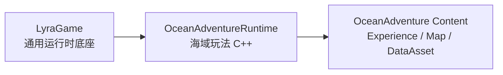

# 海域海岛冒险基础设计

> 适用工程：`LyraTemplate`，Unreal Engine 5.7。本文整理海域冒险玩法的第一阶段设计：动态生成地图、水域、离散岛屿，以及后续适配生存建造的网络同步与持久化边界。`../LyraStarterGame` 可作为完整 Lyra 参考项目，`E:/WildOmission-1.0.1-beta` 可作为生存、采集、世界分块思路参考。

## 1. 设计目标

第一阶段只建立海岛世界的底座，不处理背包、采集、建造和战斗细节。

- 世界以大范围海洋为主体。
- 陆地以岛屿形式出现，不连成大陆。
- 地图按玩家位置动态生成，制造“无限海域”的体验。
- 同一个 Seed 下，同一个世界坐标生成结果稳定。
- 后续可以接入 Lyra 背包、交互、建造、存档和多人服务器。

一句话目标：

```text
玩家在 TopDown 海面移动，周围 Chunk 动态加载，偶尔出现彼此分离的小岛，远处内容自动卸载。
```

## 2. 总体架构

建议把海域玩法做成新的 GameFeature，而不是继续堆到现有 `SimpleExperience`。

```text
Plugins/GameFeatures/OceanAdventure/
    OceanAdventure.uplugin
    Source/OceanAdventureRuntime/
    Content/
        Experience/
        Map/
        World/
        Pawn/
        UI/
```

### 2.1 模块职责

| 层 | 职责 |
|---|---|
| `OceanAdventure` GameFeature | 海域玩法入口，放 Experience、地图、生成配置、玩法资产 |
| `OceanAdventureRuntime` | 海域世界生成、Chunk、岛屿、水面、持久化适配代码 |
| `LyraGame` | 复用 Experience、PawnData、输入、相机、背包、消息、UI、网络底座 |

依赖方向：



核心规则：

- `LyraGame` 不引用 `OceanAdventureRuntime`。
- 海域玩法专属 C++ 放进 `OceanAdventureRuntime`。
- 只有跨多个玩法复用且稳定的类型才考虑放进 `LyraGame`。

## 3. 核心类设计

### 3.1 `AOceanWorldManager`

世界生成管理器。场景中放一个，服务器权威运行。

职责：

- 跟踪当前 Chunk Invoker。
- 根据玩家或船的位置计算激活 Chunk 范围。
- 创建、复用、卸载 `AOceanChunkActor`。
- 管理世界 Seed。
- 为持久化系统提供 Chunk 激活/卸载事件。

关键参数：

| 参数 | 初始值 | 说明 |
|---|---:|---|
| `WorldSeed` | 12345 | 世界生成种子 |
| `ChunkSize` | 20000 cm | 每个 Chunk 约 200 米 |
| `ActiveRadius` | 3 | 玩家周围 7x7 Chunk 激活 |
| `UnloadDelay` | 5-15 秒 | 避免边界抖动频繁卸载 |

### 3.2 `UOceanChunkInvokerComponent`

挂在玩家 Pawn 或船 Pawn 上。

职责：

- 向 `AOceanWorldManager` 报告当前位置。
- 支持多人时，每个玩家/船都可以成为 Invoker。
- 后续可按玩家视野、船速、服务器负载调整半径。

### 3.3 `AOceanChunkActor`

一个海域格子。只负责本 Chunk 内的内容。

职责：

- 根据 `ChunkCoord + WorldSeed` 确定性生成内容。
- 判断本 Chunk 是否有岛。
- 生成岛屿网格、浅滩、沙滩、基础资源点占位。
- 卸载前导出本 Chunk 的运行时变化。

初期内容：

- 海岛地形网格。
- 岛屿碰撞。
- 调试可视化边界。
- 资源点占位，不接背包。

### 3.4 `AOceanWaterPlane`

视觉水面，不按 Chunk 生成。

职责：

- 生成或持有一个超大水面平面。
- 跟随玩家或相机移动。
- 材质使用世界坐标波浪，移动水面时不露馅。

水面是视觉底盘，世界内容才走 Chunk。

```text
水面：常驻、跟随玩家、客户端表现为主
岛屿/资源/建筑：Chunk 化、服务器权威、按需复制
```

### 3.5 `UOceanGenerationSettings`

生成配置 DataAsset，方便调参。

建议字段：

| 字段 | 初始值 | 说明 |
|---|---:|---|
| `WorldSeed` | 12345 | 默认世界 Seed |
| `ChunkSize` | 20000 | Chunk 边长 |
| `IslandChance` | 0.18 | Chunk 出岛概率 |
| `MinIslandRadius` | 2500 | 最小岛半径 |
| `MaxIslandRadius` | 7000 | 最大岛半径 |
| `IslandEdgeMargin` | 3000 | 岛屿离 Chunk 边界的最小距离 |
| `TerrainResolution` | 64 | 岛屿网格分辨率 |
| `BeachHeight` | 0.05 | 沙滩高度阈值 |
| `LandHeight` | 0.18 | 陆地高度阈值 |

## 4. 动态地图生成

世界坐标转换成 Chunk 坐标：

```text
ChunkX = floor(WorldX / ChunkSize)
ChunkY = floor(WorldY / ChunkSize)
ChunkCoord = FIntPoint(ChunkX, ChunkY)
```

每次玩家跨 Chunk 或定时更新：

```text
1. 计算所有 Invoker 周围 ActiveRadius 内的 Chunk。
2. 新需要的 Chunk：创建或从对象池取出。
3. 不再需要的 Chunk：延迟卸载。
4. 卸载前保存玩家改动。
```

推荐第一版激活范围：

```text
ActiveRadius = 3
激活数量 = 7 x 7 = 49 个 Chunk
```

如果单个 Chunk 内容很少，49 个可接受；如果岛屿地形较重，可以先降到 `ActiveRadius = 2`。

## 5. 岛屿生成规则

### 5.1 保证岛屿离散

海岛感最重要的规则是：岛不能碰到 Chunk 边缘，也不能和邻近 Chunk 的岛过近。

基础约束：

```text
IslandRadius <= ChunkSize * 0.35
IslandCenter 距离 Chunk 边界 > IslandRadius + IslandEdgeMargin
```

推荐参数：

```text
ChunkSize = 20000 cm
IslandChance = 0.18
MinIslandRadius = 2500 cm
MaxIslandRadius = 7000 cm
IslandEdgeMargin = 3000 cm
```

相邻岛屿检查：

```text
1. 当前 Chunk 决定候选岛心和半径。
2. 查询周围 8 个 Chunk 的候选岛。
3. 如果两个岛心距离 < RadiusA + RadiusB + MinIslandGap，则跳过当前岛。
```

`MinIslandGap` 建议初始为 `3000-6000 cm`。

### 5.2 岛屿概率

不要每个 Chunk 都出岛，否则会像大陆群。

推荐：

```text
普通海域：IslandChance = 0.12 - 0.20
群岛海域：IslandChance = 0.30 - 0.45
深海区域：IslandChance = 0.02 - 0.08
```

第一版只做普通海域即可。

### 5.3 岛屿形状

使用径向衰减 + 噪声：

```text
Distance01 = Distance(Point, IslandCenter) / IslandRadius
Radial = 1 - Distance01
Noise = PerlinNoise(WorldX * Scale, WorldY * Scale)
Height = Radial + Noise * 0.25
```

高度分类：

| 高度 | 类型 |
|---:|---|
| `Height <= 0.05` | 深水/海水 |
| `0.05 < Height <= 0.18` | 浅水/沙滩 |
| `Height > 0.18` | 陆地 |

第一版可以只生成一层地形网格，材质用高度或顶点色区分水边、沙滩、草地。

## 6. 水域设计

水域不需要真实无限。第一版做一个跟随玩家的大水面。

```text
AOceanWaterPlane
    Mesh: 大平面或 Water Body Ocean
    Location: 跟随玩家 X/Y，Z 固定
    Material: 世界坐标波浪、法线滚动、颜色深浅
```

注意：

- 水面移动时，材质采样必须用 Absolute World Position。
- 海浪、泡沫、远景雾优先客户端表现，不走网络同步。
- 岛屿附近的浅水效果可以先用岛屿材质边缘表现，后续再加真实 Water Zone。

## 7. TopDown 视角适配

海域第一版建议使用船或海上 Pawn，而不是直接改 LyraCharacter。

```text
AOceanBoatPawn
    UOceanChunkInvokerComponent
    FloatingPawnMovement 或自定义平面移动
    Lyra CameraMode: OceanTopDown
```

相机建议：

| 参数 | 初始值 |
|---|---:|
| Pitch | `-60` 到 `-75` |
| Distance | `1800-3000` |
| FOV | `50-70` |
| Follow Lag | 轻微 |

如果第一版只验证地图生成，也可以先用现有 Pawn 加 InvokerComponent，等地图稳定后再做船。

## 8. 网络同步与持久化边界

UE 的复制适合“当前局、当前附近、当前可见”的状态；生存建造需要额外的长期世界状态。

设计原则：

```text
Replication 负责活跃区域同步。
SaveGame / 数据库负责长期世界状态。
服务器是唯一权威。
客户端只发送意图。
```

### 8.1 状态分类

| 状态类型 | 例子 | 处理方式 |
|---|---|---|
| 实时同步 | 玩家位置、船移动、采集动作、战斗 | UE Replication |
| 持久化 + 同步 | 建筑、容器、资源剩余量、岛屿改动 | 服务器生成 Actor 后复制 |
| 仅持久化 | 离线 Chunk、远处建筑群、未激活岛屿改动 | SaveGame/DB，不生成 Actor |
| 仅表现 | 海浪、泡沫、远景雾、鸟群 | 客户端生成，不同步 |

### 8.2 Chunk 存档

基础岛屿由 Seed 确定性生成，不保存完整地形。只保存玩家改变过的内容。

```text
FOceanChunkSaveData
    SchemaVersion
    ChunkCoord
    WorldSeed
    RemovedResourceIds
    ModifiedResourceStates
    BuildingSaveData
    ContainerSaveData
    LastVisitedTime
```

建筑示例：

```text
FOceanBuildingSaveData
    Guid
    ChunkCoord
    BuildingType
    Transform
    OwnerPlayerId
    Health
    CustomState
```

### 8.3 Chunk 激活流程

```text
玩家靠近
    -> OceanWorldManager 激活 Chunk
    -> 根据 Seed 生成基础岛屿和资源候选
    -> 读取 Chunk Save Delta
    -> 应用已采集、已建造、已破坏状态
    -> Spawn 需要复制的 Actor
    -> 相关客户端接收复制
```

### 8.4 Chunk 卸载流程

```text
玩家远离
    -> 标记 Chunk 待卸载
    -> 收集建筑、容器、资源变化
    -> 写入 SaveGame/DB
    -> 销毁或对象池回收 Actor
```

原型阶段可以用 `USaveGame`；长期服务器建议改成 SQLite、分片文件或后端数据库。

## 9. 生存建造适配

后续建造系统不要让全世界建筑常驻。

建筑 Actor 策略：

- 只在 Chunk 激活时 Spawn。
- `bReplicates = true`。
- 静态后进入 Dormancy。
- 受伤、拆除、交互时唤醒复制。
- Chunk 卸载前保存并销毁。

资源点策略：

- 基础资源由 Seed 生成。
- 采集后的变化保存为 Delta。
- 玩家采集必须走服务器验证。
- 采集结果通过 Lyra 背包系统写入 `ULyraInventoryManagerComponent`。

采集权威流程：

```text
客户端请求采集
    -> Server RPC / GameplayAbility TargetData
    -> 服务器验证距离、工具、资源剩余量
    -> 修改资源状态
    -> 添加物品到 LyraInventory
    -> 标记 Chunk Dirty
    -> 复制结果与 UI 消息
```

## 10. 第一阶段实施顺序

### 阶段 1：海域世界原型

1. 创建 `OceanAdventure` GameFeature。
2. 创建空海图，只放天空、光照、出生点、水面和 `AOceanWorldManager`。
3. 创建 `UOceanGenerationSettings`。
4. 实现 `UOceanChunkInvokerComponent`。
5. 实现 `AOceanWorldManager` 动态激活 Chunk。
6. 实现 `AOceanChunkActor` 调试显示 Chunk 边界。

验收：

```text
玩家移动时，周围 Chunk 按坐标稳定创建和卸载。
```

### 阶段 2：岛屿生成

1. 每个 Chunk 根据 Seed 判断是否生成岛。
2. 使用径向噪声生成岛屿网格。
3. 添加沙滩/草地材质区分。
4. 添加简单碰撞。
5. 加相邻岛屿距离检查。

验收：

```text
岛屿分散出现，不贴 Chunk 边缘，不连成大陆。
```

### 阶段 3：水面与视角

1. 实现跟随玩家的 `AOceanWaterPlane`。
2. 创建 `OceanTopDown` CameraMode。
3. 接入 Ocean Experience / PawnData。

验收：

```text
TopDown 移动时海面连续，岛屿稳定加载，远处卸载无明显跳变。
```

### 阶段 4：为生存玩法预留接口

1. 给 Chunk 增加 `Dirty` 标记。
2. 定义 Chunk Save Data 结构。
3. 预留资源点 ID 和建筑 SaveData。
4. 添加调试命令：显示 ChunkCoord、Seed、岛屿状态。

验收：

```text
基础世界生成不依赖背包/建造，但数据结构允许后续保存玩家改动。
```

## 11. 风险与约束

| 风险 | 规避方式 |
|---|---|
| 岛屿连成大片 | 限制半径、远离 Chunk 边界、检查邻近岛距 |
| Chunk 频繁抖动加载 | 加卸载延迟，按 Chunk 坐标变化触发 |
| 地形生成卡顿 | 降低分辨率、异步准备数据、对象池复用 |
| 网络同步过重 | 远处不 Spawn Actor，静态建筑 Dormant |
| 存档膨胀 | 保存 Delta，不保存 Seed 可重建的基础地形 |
| 客户端作弊 | 服务器权威生成、验证采集和建造请求 |

## 12. 推荐默认参数

```text
WorldSeed = 12345
ChunkSize = 20000
ActiveRadius = 3
IslandChance = 0.18
MinIslandRadius = 2500
MaxIslandRadius = 7000
IslandEdgeMargin = 3000
MinIslandGap = 5000
TerrainResolution = 64
BeachHeight = 0.05
LandHeight = 0.18
UnloadDelay = 10
```

## 13. 后续扩展方向

- 群岛、深海、风暴区等 Biome。
- 漂浮资源、沉船、礁石、鱼群、宝箱。
- Lyra 背包采集闭环。
- 船只升级、工具耐久、合成。
- 建筑放置、容器库存、据点保存。
- 多人 Dedicated Server 长期世界。
- 小地图/航海图，仅显示已探索 Chunk。

## 14. 一句话总结

海岛世界不要真正“无限生成全部内容”，而是用稳定 Seed 生成基础海域，用玩家周围 Chunk 激活可见世界，用 Save Delta 记录玩家改变。海水常驻表现，岛屿离散生成，建筑和资源只在活跃区域复制。

## 15. 已实现的 Chunk 运行时骨架

第一阶段 Chunk 系统已经放入独立 GameFeature：

```text
Plugins/GameFeatures/OceanAdventure/
    OceanAdventure.uplugin
    Source/OceanAdventureRuntime/
        World/OceanWorldManager
        World/OceanChunkActor
        World/OceanChunkInvokerComponent
```

当前行为：

- `AOceanWorldManager` 只在服务器计算 Chunk，合并所有 Invoker 的激活范围。
- `UOceanChunkInvokerComponent` 可挂到玩家 Pawn 或船上，默认半径为 3。
- Invoker 在服务器注册，客户端修改半径时通过 Server RPC 请求并在服务器限幅。
- `AOceanChunkActor` 由服务器创建和销毁，`ChunkCoord`、`ChunkSize`、`WorldSeed` 使用初始复制发送给客户端。
- Chunk 按连接相关性复制，每个客户端只接收自己 ViewTarget 周围半径内的 Chunk。
- 离开范围的 Chunk 默认延迟 10 秒卸载，避免跨边界时频繁创建和销毁。
- 负世界坐标使用 `floor` 换算，`-1 cm` 正确落入 `(-1, Y)` Chunk。
- `On Chunk Initialized` 蓝图事件是后续接入岛屿网格、资源候选和客户端表现的入口。

### 15.1 GameFeature 接入顺序

当前采用 Actor Manager，不改成 Subsystem。推荐流程：

```text
选择 Ocean Experience
    -> 激活 OceanAdventure GameFeature
    -> 加载海域地图
    -> 地图中的 AOceanWorldManager BeginPlay
    -> Pawn/船上的 Invoker 注册
    -> 服务器创建周围 Chunk
```

接入步骤：

1. 在 Ocean Experience 中启用 `OceanAdventure` GameFeature。
2. 在插件激活后才加载的海域地图中放置一个 `AOceanWorldManager`。
3. 给玩家 Pawn 或船 Pawn 添加 `UOceanChunkInvokerComponent`。
4. 建立 `AOceanChunkActor` 蓝图子类，需要查看边界时打开 `Draw Debug Bounds`。
5. 将该蓝图类设置到 Manager 的 `ChunkClass`。
6. 使用 PIE 两名玩家验证：两个玩家附近 Chunk 取并集生成，但每条连接只接收自己附近的 Chunk。

加载约束：常驻地图如果早于 GameFeature 激活，不应直接预放来自该插件模块的 Actor。此时应改为插件激活后 Spawn Manager，或者先激活插件再切换到海域地图。第一版采用后者。

### 15.2 编辑器 Chunk 测试关卡

当前提供以下测试资产：

```text
/OceanAdventure/Maps/L_OceanChunkTest
/OceanAdventure/Blueprints/BP_OceanChunk_Debug
/OceanAdventure/Blueprints/BP_OceanChunk_TestInvoker
```

`L_OceanChunkTest` 复用项目默认 Lyra Experience，暂不接入主菜单。关卡包含一个 `AOceanWorldManager` 和一个固定测试 Invoker；Invoker 使用默认半径 3，因此服务器启动后会生成 7x7，共 49 个 Chunk。Manager 使用开启 `Draw Debug Bounds` 的 Chunk 蓝图，PIE 中可直接观察边界和坐标。

编辑器内测试步骤：

1. 在 Content Browser 中启用 `Show Plugin Content`。
2. 打开 `/OceanAdventure/Maps/L_OceanChunkTest`。
3. 在 Output Log 命令输入框执行 `Log LogOceanAdventure Verbose`。
4. 使用 `Selected Viewport` 或 `Standalone` 启动 PIE。
5. 在 Output Log 中确认出现 `Registered chunk invoker ... with OceanWorldManager`。
6. 按 `F8` 退出玩家控制，在 PIE World Outliner 中移动 `Ocean Chunk Test Invoker` 超过 20000 cm，观察新 Chunk 创建以及旧 Chunk 在延迟后卸载。

此关卡只验证 Manager、Invoker、Chunk 确定性生成和服务器运行链路。玩家 Pawn 跟随、TopDown 相机、水面和岛屿表现将在正式 Ocean Experience 中接入。
